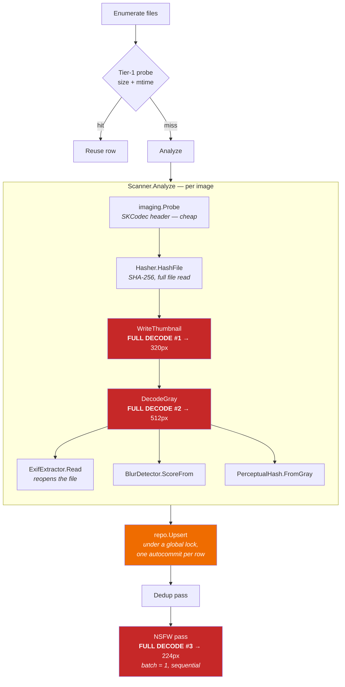
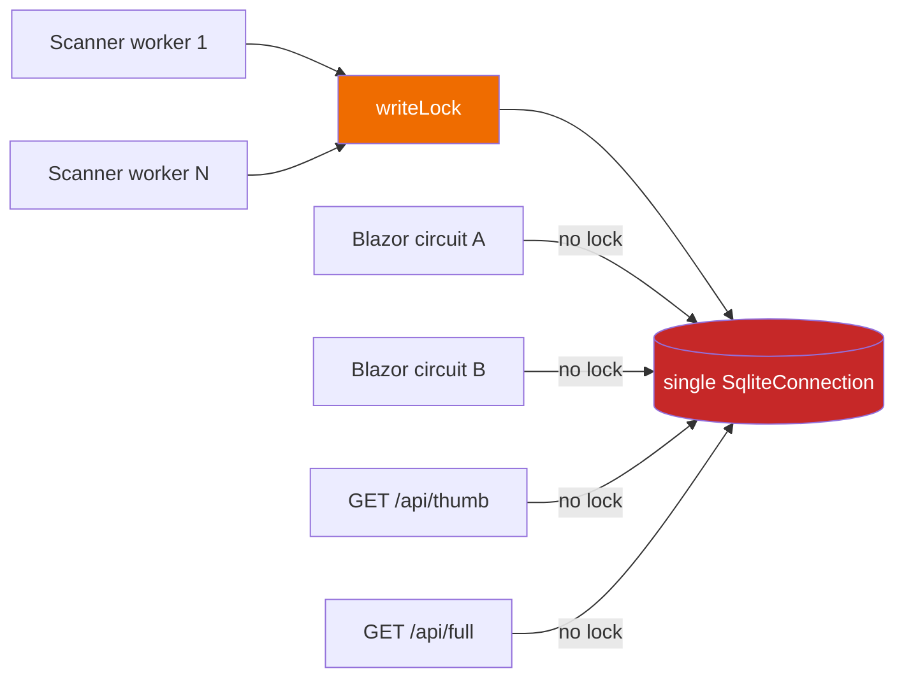
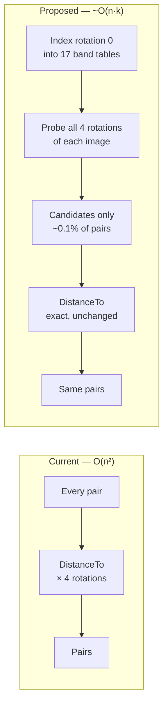
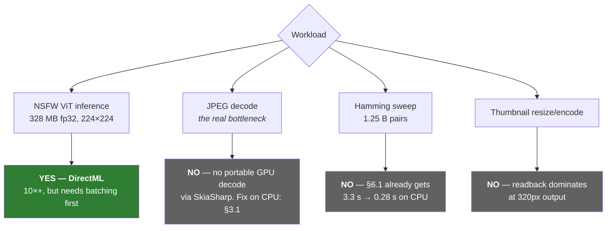
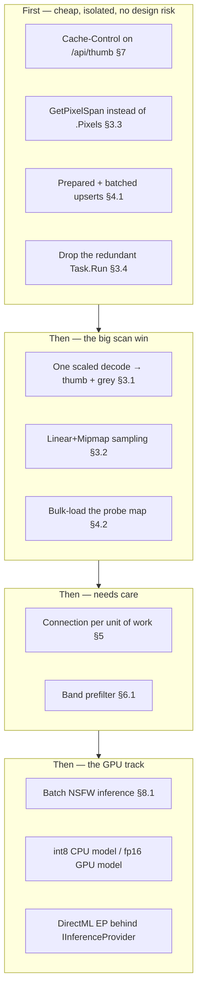

# SnapZap — Performance Analysis

A code-level review of where SnapZap spends its time, what can be recovered on an ordinary
machine, and what a discrete GPU is (and is not) worth.

**This was a proposal; the tech-spec it fed ("CPU Performance Optimisation") has since been
implemented — see [§11](#11-implementation-status) for what shipped, what was verified, and what
remains outstanding.** Every number below was measured on this repo's dependency versions, on an
Apple M1 Pro (10 cores, 32 GB, .NET 10.0.302), against a synthetic 4000×3000 / 1.4 MB JPEG.
Benchmarks and caveats are in [§10](#10-methodology).

---

## 1. Summary

| # | Change | Measured | Scope | Risk |
|---|---|---|---|---|
| **1** | One scaled decode per image instead of two full ones | **3.2×** scan CPU/image | Scan | Low |
| **2** | Pigeonhole band prefilter for variant matching | **6.5× / 12× / 20×** at 20k / 50k / 100k photos | Dedup | Medium |
| **3** | Batch NSFW inference (prerequisite for GPU) | ~2× CPU; unlocks 10×+ GPU | NSFW | Low |
| **4** | Batched, prepared SQLite upserts | **10.8×** on the write path | Scan | Low |
| **5** | `Cache-Control: immutable` on `/api/thumb` | Eliminates thumbnail refetch | UI | Trivial |
| **6** | `GetPixelSpan()` instead of `.Pixels` | **5.2×** on pixel loops, −768 KB alloc/image | Scan, NSFW | Trivial |
| **7** | Bulk-load the cache probe instead of per-file query under a lock | **8×** on probe (267→32 ms at 40k) | Rescan | Low |
| **8** | DirectML execution provider | See [§6](#6-what-a-gpu-buys) | NSFW | Medium |

Two things worth separating out before the list:

- **A correctness bug turned up during the review** — one `SqliteConnection` is shared across
  scanner threads, Blazor circuits and two HTTP endpoints. See [§5](#5-a-correctness-bug-found-on-the-way).
- **Every downscale in the app is nearest-neighbour.** `SKSamplingOptions.Default` resolves to
  `Filter=Nearest, Mipmap=None` — verified against SkiaSharp 4.150.1. This is a *quality* finding
  with performance consequences; see [§3.2](#32-every-downscale-is-nearest-neighbour).

---

## 2. Where the time actually goes

The scan dominates everything else, and inside the scan, **decode dominates**. Hashing, EXIF,
the Laplacian and the perceptual hash are all rounding errors next to turning JPEG bytes into
pixels — and the current pipeline does that twice per image, then a third time in the NSFW pass.



`CLAUDE.md` states that sharing the greyscale decode between blur and the perceptual hash was
"the largest single saving in this rewrite." That is true and the sharing is real — but the
thumbnail still pays for its own independent full-resolution decode immediately before it, and
the NSFW pass pays for a third one later. The saving was banked once and then given back twice.

---

## 3. Scan path

### 3.1 One scaled decode instead of two full ones — 3.2×

`Scanner.Analyze` (`Scanning/Scanner.cs:171`) calls `SKBitmap.Decode(path)` twice: once inside
`WriteThumbnail` and once inside `DecodeGray`. Both immediately throw away >95% of the pixels
they just produced — 12 megapixels decoded to produce a 320px thumbnail and a 512px grey buffer.

Two independent fixes compose:

**Decode once, derive both.** The 512px buffer is a superset of what the 320px thumbnail needs.
One decode, two resizes.

**Decode at reduced scale.** `SKCodec.GetScaledDimensions(float)` and
`SKBitmap.Decode(SKCodec, SKImageInfo)` both exist in SkiaSharp 4.150.1 (verified). Asking
libjpeg-turbo for 500×375 instead of 4000×3000 lets it skip the full IDCT and upsampling.

Measured, replacing the current two-decode sequence with one scaled decode feeding both outputs:

```
Scanner.Analyze  current (2 full decodes) :    63.4 ms
Scanner.Analyze  one scaled decode        :    19.8 ms   (3.20x faster)
```

A caveat worth stating because it cuts against intuition: **scaled decode alone is only ~1.5×**
(26.2 → 17.5 ms), not the 8× the pixel ratio suggests. libjpeg-turbo still entropy-decodes the
whole stream; only the inverse-DCT and upsampling shrink. Most of the 3.2× comes from *not
decoding twice*. Both changes are worth making, but the decode-count fix is the load-bearing one.

At 40k photos on 8 effective cores this is roughly **5.3 min → 1.7 min** of scan CPU.

### 3.2 Every downscale is nearest-neighbour

```
SKSamplingOptions.Default: Filter=Nearest  Mipmap=None  UseCubic=False
```

All three resize sites pass `SKSamplingOptions.Default`:

| Site | Downscale | Consequence |
|---|---|---|
| `SkiaImageService.WriteThumbnail:35` | 4000 → 320 | Visibly aliased thumbnails in the grid |
| `SkiaImageService.DecodeGray:65` | 4000 → 512 | Aliasing feeds the Laplacian **and** the perceptual hash |
| `NsfwPreprocess.ToTensor:20` | 4000 → 224 | Aliased input to a ViT — off-distribution from training |

The middle one is the interesting one. `PerceptualHash.BoxSample` goes to considerable trouble to
box-average 512px down to 17 cells, and its doc comment explains exactly why point sampling would
be wrong: *"a resize and a re-encode of the same photo … can land on visibly different bits."*
That reasoning is correct — and the nearest-neighbour resize immediately upstream has already
done the point sampling the box filter is defending against. A 12 MP → 512px nearest resize keeps
1 pixel in 61 and discards the rest.

This is not primarily a speed issue, but it is not free either: it likely costs the variant
detector real recall, and it means the NSFW model is scoring images that don't look like its
training distribution. Note the 3.2× in §3.1 was measured with `Linear + Mipmap` sampling on the
optimised side and `Default` on the current side — **the quality fix is already paid for** by the
decode consolidation.

### 3.3 `.Pixels` allocates a 768 KB array per call — 5.2×

`SKBitmap.Pixels` materialises a managed `SKColor[]`. `DecodeGray` and `NsfwPreprocess.ToTensor`
both use it. `GetPixelSpan()` returns the underlying bytes with no allocation:

```
.Pixels      scan 512x384:   1.02 ms   (allocates 768KB SKColor[] per call)
GetPixelSpan scan 512x384:   0.20 ms   (zero alloc, 5.2x faster)
```

At 40k photos that is ~30 GB of pure garbage the collector has to walk, on top of the time.

### 3.4 Smaller scan items

| Item | Location | Note |
|---|---|---|
| Redundant `stat` per file | `Scanner.Enumerate:252` | `Directory.EnumerateFiles` yields paths; `new FileInfo(path)` then re-stats on first property access. `new DirectoryInfo(root).EnumerateFiles(...)` yields `FileInfo` pre-populated from the directory walk — one syscall per file saved. |
| Redundant thread hop | `Scanner.ScanAsync:105` | `await Task.Run(() => Analyze(...))` inside `Parallel.ForEachAsync`. The loop already owns a worker; this parks it and hands CPU-bound work to another pool thread. |
| Laplacian allocates + double-passes | `BlurDetector.cs:35-57` | Allocates a second `float[w*h]`, then `Variance` walks it twice. Sum and sum-of-squares can be accumulated in the same pass that computes the response — no intermediate array, and the inner loop is trivially vectorisable with `Vector<float>`. |
| Per-file progress reports | `Scanner.Report:229` | One `IProgress.Report` per image marshals to the Blazor circuit 40k times. Throttle to ~10/s. |
| `SHA256.Create()` per file | `Hasher.cs:18,27` | `SHA256.HashData(stream)` is static and allocation-free. Also worth a `FileStream` with `FileOptions.SequentialScan` and a 1 MB buffer instead of the 4 KB default. |

---

## 4. Data layer

### 4.1 Per-row autocommit upserts — 10.8×

`ImageRepository.Upsert` (`Data/ImageRepository.cs:31`) creates a fresh `SqliteCommand`, re-parses
the SQL, and rebuilds seven parameters via `AddWithValue` for every row — each one its own implicit
transaction. Against a prepared command with reused parameters, batched into transactions of 500:

```
20,000 upserts (WAL, synchronous=NORMAL)
  A per-row command + autocommit (current) :    998 ms  ( 20,048 rows/s)
  B prepared + batched tx of 500           :     92 ms  (216,713 rows/s)
  -> 10.8x faster
```

Honest ranking: this is ~0.9 s saved on a 20k-photo fresh scan, against minutes of decode. It's a
10.8× on a small slice. Do it — it's cheap and it compounds once decode gets 3.2× faster — but it
is not where the wall-clock is.

Batching does need a decision about durability: a crash mid-scan would lose up to one batch of
rows, which the next scan re-analyses. That is already the existing recovery path for any
interrupted scan, so the exposure is bounded.

### 4.2 The probe lock — 8× on rescan

Every file — including cache hits — takes a process-wide lock to run a single-row `SELECT`
(`Scanner.ScanAsync:97`). The scan's whole fast path is serialised behind one mutex.

```
40,000-photo cached rescan — the tier-1 probe path only
  A per-file query under the global lock (current):    267 ms
  B one bulk load + lock-free dictionary          :     32 ms
  -> 8x faster; the map costs ~3 MB at 40k rows
```

In absolute terms this is 235 ms — the "near-instant rescan" claim in DESIGN holds up. It matters
more than the number suggests for a different reason: on a *fresh* scan, every cache-miss worker
also queues on this lock before it may begin decoding, so the lock intrudes on the expensive path
too. Loading `(path → size, mtime, analyzed)` once into a dictionary costs ~3 MB and removes the
contention entirely.

### 4.3 `SqliteCacheMode.Shared`

`Database.cs:19` opens with shared-cache mode. Shared cache introduces table-level locking between
connections and is generally discouraged for concurrent access — it works against the WAL mode
enabled on the very next line. Worth removing as part of the connection work in §5.

Also absent and cheap: `PRAGMA mmap_size`, `PRAGMA temp_store=MEMORY`, and a larger
`PRAGMA cache_size`.

---

## 5. A correctness bug found on the way

`CatalogService` is a singleton holding a single `Database`, which holds a single
`SqliteConnection` (`CatalogService.cs:46`, `Database.cs:21`). That one connection is used
concurrently by:

- scanner worker threads (guarded by `Scanner`'s private `writeLock`),
- every Blazor circuit's `AppState` (`AppState.LoadAsync:378`, `SetKeeperAsync`, …),
- `GET /api/thumb/{hash}` and `GET /api/full/{id}` (`Program.cs:41,50`),
- the dedup and NSFW passes.

**`SqliteConnection` is not thread-safe**, and only the scanner takes the lock. Nothing stops a
circuit issuing `LoadAsync` while a scan is mid-upsert on the same connection.



The fix is also the concurrency fix: open a connection per unit of work (SQLite connection open is
cheap, and `Microsoft.Data.Sqlite` pools them), keep a single dedicated writer, and let WAL give
readers true concurrency. That removes the global lock from §4.2 and the shared-cache problem from
§4.3 at the same time.

I have not attempted to reproduce a failure — the window is narrow and it would likely present as
a rare, unreproducible `SqliteException` or a garbled read rather than a clean crash. Flagging it
as a design-level defect rather than an observed one.

---

## 6. Duplicate detection

### 6.1 The band prefilter — 6.5× to 20×, exactly

`VariantFinder` compares all pairs, and `DEDUP-V2` defends this deliberately: unrelated photos
differ in ~half their bits, so `DistanceTo` bails on the first word. That reasoning is sound, and
the note says to revisit past ~150k photos.

Two measured corrections to the premise:

**The early bail is ~8× less effective than described, not 4×.** With rotations enabled the whole
five-word loop runs once per rotation, and `best` almost never reaches 0 to trigger the outer break:

```
brute force, rotations ON  :  634 ms   (20k images, threshold 16)
brute force, rotations OFF :   81 ms   -> rotations cost 7.8x, not 4x
```

This is a reason to fix the algorithm, **not** a reason to turn rotations off — see
[§6.2](#62-should-variantrotations-default-to-off-no).

**The revisit threshold is nearer than 150k.** A pigeonhole band prefilter — split 272 bits into 17
bands of 16, index them, and only compare pairs sharing at least one identical band — is **exact**,
not approximate. If two hashes differ by ≤16 bits they can differ in at most 16 bands, so at least
one of 17 must match. No recall loss:

| Photos | Brute force | Band prefilter | Speedup | Candidate pairs |
|---:|---:|---:|---:|---|
| 20,000 | 634 ms | 97 ms | **6.5×** | 256 K of 200 M |
| 50,000 | 3,319 ms | 277 ms | **12.0×** | 1.6 M of 1.25 B |
| 100,000 | 13,856 ms | 693 ms | **20.0×** | 6.4 M of 5.0 B |

Both approaches produced identical pair sets in every run (asserted in the benchmark).



**Caveat, stated plainly:** the benchmark used uniformly random hashes. Real libraries cluster, so
buckets will skew and both sides will be slower than shown. The candidate-count reduction is
structural and survives; the exact multiplier on a real library will differ. Worth re-measuring
against a real catalogue before committing.

The grouping stage downstream is unchanged — this only changes which pairs reach it, and it
provably reaches the same set. `GrouperTests` and the complete-linkage invariant are untouched.

### 6.2 Should `VariantRotations` default to off? No

It is already a setting (`DedupSettings.VariantRotations`, default `true`) and already a user-facing
checkbox (`Components/SetupDialog.razor:56`). So the question is only about the default — and the
answer is to keep it on, for two independent reasons.

**Reason 1: the 8× is an artifact of the brute-force sweep, and it mostly evaporates.** Re-measured
at the repo's actual default threshold (`VariantMaxBits = 20`), 50k images:

| | rotations OFF | rotations ON | cost of rotations |
|---|---:|---:|---:|
| Brute force (current) | 486 ms | 3,923 ms | **8.1×** |
| Band prefilter (§6.1) | 175 ms | 548 ms | **3.1×** |

The line that decides it:

```
prefilter + rotations   548 ms
brute force, NO rotations   486 ms      -> 0.9x
```

**Adopting the prefilter buys rotation matching for free.** You would pay roughly what you pay
today for *not* having the feature. 548 ms once per dedup run, at 50k photos, is not a cost worth
trading detection quality for.

**Reason 2: rotations are currently load-bearing, because the app never applies EXIF orientation.**
`grep` finds no reference to `EncodedOrigin` or orientation anywhere in `src/`. Verified against a
JPEG tagged `Orientation=6`:

```
SKCodec.EncodedOrigin      : RightTop      (correctly reported)
SKCodec.Info (raw pixels)  : 400x200
SKBitmap.Decode result     : 400x200       -> orientation NOT applied
```

So every perceptual hash is computed on raw sensor pixels, in whatever orientation the camera
wrote them. A portrait phone photo (orientation 6) and a copy exported with the rotation baked into
the pixels are genuinely 90° apart in hash space. Rotation matching is what currently catches that
pair — and it is one of the more common duplicate shapes in a real phone library. Defaulting it off
would silently drop that class of match, in a tool whose entire job is finding it.

Note also that rotations only add recall; they cannot manufacture a false positive that the
unrotated comparison would have rejected on a *different* pair. That fits the stated
`VariantMaxBits` philosophy ("a miss costs less than a false positive") rather than fighting it.

**The change actually worth making is upstream.** Applying `codec.EncodedOrigin` during
`DecodeGray` would normalise orientation before hashing, collapsing most rotation-variant pairs into
ordinary same-orientation pairs. Rotation matching then becomes a cheap backstop for genuinely
rotated-and-re-saved photos instead of the primary mechanism — at which point defaulting it off
would be a defensible conversation. Doing it in the other order gives up recall to buy back time
the prefilter was going to return anyway.

> **Probable side effect worth checking:** the same gap means `WriteThumbnail` also decodes raw
> pixels and writes a thumbnail with no orientation tag, so portrait-tagged photos should render
> **sideways in the grid**. Meanwhile `/api/full/{id}` serves the original file, which the browser
> *does* orient correctly. If a portrait photo looks sideways in the grid and upright in the preview
> modal, that confirms it. I could not test this against a real library from here.

### 6.3 Smaller dedup items

- **Triangular load imbalance** (`VariantFinder.cs:40`). `Parallel.For(0, n)` over a `j = i+1`
  inner loop gives thread `i=0` n comparisons and thread `i=n-1` zero. The default range partitioner
  hands out contiguous chunks, so the last threads finish early and idle. Pairing `i` with `n-1-i`
  evens it out. (Mostly moot if §6.1 lands.)
- **Pointer chasing.** Each image's signature is its own `ulong[20]` on the heap. A single flat
  `ulong[]` for the whole catalogue (20 MB at 100k photos) would let the sweep stream contiguously.
- **Delegate + dictionary in the inner loop.** `SimilarityGrouper.Merge` is O(|left|×|right|) and
  every call does two `byId[…]` lookups plus a delegate dispatch (`VariantFinder.cs:60`). Passing
  dense indices instead of ids would remove both.

---

## 7. UI and serving

**`/api/thumb/{hash}` sends no cache headers** (`Program.cs:41`). Thumbnails are content-addressed
by SHA-256 — they are perfectly immutable, and the browser is re-requesting them on every scroll
that re-windows the grid. Adding `Cache-Control: public, max-age=31536000, immutable` is a one-line
change and is probably the single best effort-to-benefit ratio in this document.

**`/api/full/{id}` serves the original file** (`Program.cs:50`) — for a 24 MP JPEG that is ~20 MB
over the wire and a full-resolution decode in the browser for a preview modal. A cached mid-size
preview (~1600px) would make the modal open instantly.

**`LoadAsync` is synchronous** (`AppState.cs:369`). It returns `Task.CompletedTask` after doing all
its work inline: a full `Under(scanRoot)` read, a `Groups()` read, and roughly a dozen LINQ passes
over the entire library — on the Blazor circuit's thread. At 40k photos that is a visible stall on
every load, and it holds the shared connection ([§5](#5-a-correctness-bug-found-on-the-way))
for the duration.

**Publish flags.** The Windows publish command sets no `PublishReadyToRun`. On a 130 MB
self-contained single-file exe, R2R meaningfully cuts cold start for a double-click desktop app.

---

## 8. What a GPU buys

Short version: **there is exactly one worthwhile GPU target, and batching is the prerequisite.**



### 8.1 The one that pays: NSFW inference

`IInferenceProvider` already exists in `Platform/IPlatformServices.cs:38` with a `DirectML` backend
enumerated. It is declared and never implemented — `NsfwScorer` constructs
`new OnnxNsfwClassifier(modelPath)` with `options: null` (`NsfwScorer.cs:50`), so ORT runs default
CPU. The design is right; the wiring is absent.

**Batching is not optional, it is the gate.** `OnnxNsfwClassifier.ScoreBitmap` runs one image per
`Run` call, and `NsfwScorer` awaits a separate `Task.Run` per image. A ViT at batch=1 leaves a
discrete GPU almost entirely idle — kernel-launch and PCIe transfer overhead dominate the actual
matmuls. Batch 16–32 is where a GPU starts to mean anything, and it is worth roughly 2× on CPU
by itself. Everything below assumes batching lands first.

**DirectML is the right EP for this app**, verified by inspecting the package:

```
microsoft.ml.onnxruntime.directml/1.24.4/runtimes/
  win-x64/native/onnxruntime.dll
  win-arm64/native/onnxruntime.dll
```

- Runs on **any DX12 GPU** — NVIDIA, AMD, Intel Arc, and integrated graphics. One code path covers
  the whole Windows install base, including users with no discrete card.
- No CUDA/cuDNN redistributable, no driver-version matrix. `DirectML.dll` ships with Windows
  (10 1903+). This preserves the self-contained-exe and no-paid-dependency constraints.
- `IncludeNativeLibrariesForSelfExtract=true` is already set in the publish command, which is what
  the native EP needs.

**Two packaging constraints, both verified here:**

1. The DirectML package **ships its own `onnxruntime.dll` for win-x64/win-arm64** and therefore
   conflicts with `Microsoft.ML.OnnxRuntime`. The reference has to be RID-conditional — DirectML for
   the Windows build, the CPU package for the macOS dev build. Not both.
2. **It lags.** Latest DirectML is **1.24.4** against the **1.27.1** CPU package currently
   referenced in `SnapZap.Core.csproj`. Adopting it pins the Windows build back three minor
   versions. Worth confirming that gap is still current before committing.

**Why not CUDA/TensorRT.** Faster on NVIDIA — probably 2–3× over DirectML — but it needs CUDA 12 +
cuDNN either installed by the user or shipped as ~1–2 GB of redistributables. That breaks the
130 MB single-file exe and the "needs nothing installed" promise in the README. Recommend against
shipping it; optionally detect and use it if the provider DLLs happen to be present.

**Model precision.** The 328 MB fp32 model is the wrong artifact for both targets:

| Target | Format | Size | Expected |
|---|---|---|---|
| CPU (no GPU / integrated) | int8 dynamic quantised | ~86 MB | 2–3× faster, smaller download |
| Discrete GPU | fp16 | ~164 MB | ~2× over fp32 on tensor-core hardware |

Shipping the int8 model as the default would also cut the sidecar download by ~75%, which is its
own win for users who never touch a GPU.

**Also worth doing regardless of backend:**

- `NsfwPreprocess.ToTensor` writes through `DenseTensor`'s four-dimensional indexer
  (`tensor[0, c, y, x]`) — 150k strided, bounds-checked writes per image, on top of a `.Pixels`
  allocation. A flat approximation measured **2.4× faster** (0.379 → 0.155 ms); the real
  `DenseTensor` indexer is slower still than what I benchmarked, so the true gap is larger.
- `ScoreFile` full-resolution-decodes a 12 MP image to feed a 224×224 network — the same
  scaled-decode fix as §3.1 applies, and the sampling issue from §3.2 matters most here.
- `results.First(r => r.Name == …).AsEnumerable<float>().ToArray()` allocates per inference; ORT's
  `IOBinding` / `OrtValue` API lets input and output buffers be reused across the batch.

**Realistic end state.** The NSFW pass over 40k photos is currently minutes-to-tens-of-minutes,
sequential, batch=1, fp32. Batching + fp16 + DirectML on a mid-range discrete GPU should put it in
the low single-digit minutes. I have not measured this — there is no Windows hardware or discrete
GPU in this environment, and I am not going to invent a number for it.

### 8.2 The ones that don't

**JPEG decode — the actual bottleneck — has no portable GPU answer.** SkiaSharp exposes no
GPU-decode path, and nvJPEG is CUDA-only and NVIDIA-only. This is the honest disappointment of the
GPU question: the thing that costs the most is the thing the GPU can't help with. The answer for
decode is [§3.1](#31-one-scaled-decode-instead-of-two-full-ones--32), on the CPU, on every machine.

**The Hamming sweep looks like a perfect GPU workload and isn't worth it.** 1.25 B independent
XOR+popcounts is exactly what a GPU eats, and ComputeSharp (MIT, D3D12) would fit the stack. But
the band prefilter already takes 50k photos from 3.3 s to 0.28 s on the CPU. A GPU might reach
0.1 s. That is 180 ms in exchange for a Windows-only compute dependency and a second
implementation of a safety-critical matcher to keep in sync. **Fix the algorithm, skip the GPU.**

**Thumbnail resize/encode on a GPU surface** loses to readback cost at 320px outputs.

---

## 9. Suggested sequence



§3.1 and §3.2 belong in the same change — the sampling fix rides free on the decode consolidation,
and both touch the same twenty lines of `SkiaImageService`.

The band prefilter (§6.1) touches safety-critical matching. It is exact by construction, but it
should land behind the existing `GrouperTests` plus a new test asserting that prefiltered and
brute-force pair sets are identical on a real catalogue — which is the property the benchmark
already checks synthetically.

---

## 10. Methodology

All measurements: Apple M1 Pro, 10 cores, 32 GB, .NET 10.0.302, Release, against this repo's
pinned dependency versions (SkiaSharp 4.150.1, Microsoft.Data.Sqlite 10.0.10). Each figure is the
mean of 10–200 iterations after a warm-up pass. Benchmarks were written standalone rather than
against the SnapZap assemblies, reproducing the exact call sequences from the cited source lines.

**What this means for the numbers.** The Windows target is x64 with different JPEG-decode and
storage characteristics; treat every multiplier as a direction and a rough magnitude, not a
promise. The ratios should hold better than the absolute times.

**Specific caveats:**

- The test image is synthetic (drawn circles, 4000×3000, JPEG q88, 1.4 MB). Real photographs have
  different entropy and will decode somewhat differently.
- Dedup benchmarks used uniformly random hashes. Real libraries cluster; see the caveat in §6.1.
- Scan figures are per-image CPU cost, not wall clock — the scan is parallel, so divide by
  effective core count for elapsed time.
- I ran no end-to-end scan against a real photo library, and no NSFW inference at all (the model
  sidecar is not installed in this checkout). The NSFW findings are from reading the code and
  benchmarking the preprocessing in isolation; the GPU projection in §8.1 is deliberately left
  unquantified.
- The thread-safety issue in §5 is a design-level finding from reading ownership and call sites.
  It was not reproduced.

---

## 11. Implementation status

The tech-spec built from this analysis ("CPU Performance Optimisation — Scan, Dedup and Serving")
has been implemented in full except NSFW batching (deferred — see below), on a macOS dev sandbox
with no Windows machine and no real photo library available. That is a real gap against what the
spec's own acceptance criteria ask for, and it is recorded here rather than papered over.

**What was verified, in this environment:**

- **Correctness, exhaustively.** All pre-existing tests pass unmodified; golden values captured
  before any code change confirm SHA-256 (`Hasher`), the NSFW tensor (`NsfwPreprocess.ToTensor`)
  and blur scores (`BlurDetector`) are byte/value-identical after their respective optimisations.
  EXIF orientation is verified against all eight `SKEncodedOrigin` values via hand-built EXIF
  fixtures, independent of the transform under test. The band prefilter's pair sets are asserted
  identical to brute force at six thresholds (4/12/20/32/45/60), with which code path executed
  checked explicitly — **this caught a real exactness bug in tech-lead review**: the original
  `bandWidth = ceil(272 / bandCount)` allocation silently produced fewer real bands than
  `bandCount` whenever it didn't divide evenly (31 instead of 33 at `threshold=32`), breaking the
  pigeonhole guarantee for roughly 40% of the UI slider's range and dropping real matches with no
  error and no truncation flag. Fixed by `VariantFinder.BandLayout`, which allocates exactly
  `bandCount` non-empty bands via floor-division-plus-remainder; see its doc-comment and
  `BandPrefilterTests.Threshold_32_finds_a_match_whose_differing_bits_spread_across_every_legacy_band`
  for the regression test, which was confirmed to fail against the pre-fix allocation and pass
  against the fix. The signature-recipe invalidation (eager clear / lazy backfill split) is
  verified for a single bump, two bumps with no detection run in between, and cancellation
  mid-backfill. `ByIds`' reordering-and-chunking contract is verified against arbitrary order,
  duplicate ids, unknown ids and >500 entries.
- **The pipeline runs and produces plausible numbers** against a small synthetic fixture set
  (`PerfBaselineTests`, opt-in via `PC_RUN_PERF_BASELINE=1` — skipped by default, same precedent as
  `NsfwModelValidation`). This confirms the code paths execute and allocate roughly what's
  expected; it is not a substitute for the figures below.

**What remains unverified — requires the Windows run and real library this spec calls for:**

- **Every performance AC (14-20).** The 2×/3× floors and the specific multipliers throughout this
  document (3.2× scan, 10.8× batched writes, 8× probe map, 6.5-20× band prefilter, 30% allocation
  drop, cold-start/size deltas from ReadyToRun) are all M1-measured predictions or synthetic-fixture
  smoke tests, not Windows-measured results. `docs/DEDUP-V2.md` §5.1 and `CLAUDE.md` have been
  updated to describe *what the code now does* (the band prefilter, its exactness argument, its
  fallback), which is independent of what the Windows numbers turn out to be.
- **The band-prefilter crossover** (`VariantFinder.BandWidthFloor`, currently 6 bits) is a
  reasoned placeholder, not a measured one. Re-measure per §6.1's caveat — real libraries cluster,
  so both the crossover point and the multipliers above it will differ from the uniform-random
  benchmark.
- **NSFW batching (Task 27) was deferred outright**, per the tech-spec's own instruction: no
  `PC_NSFW_MODEL` or `PC_NSFW_FIXTURES` are available in this environment, and shipping it without
  score-preservation evidence is exactly what TD-1 forbids.
- **AC 20** (published `.exe` cold-start) needs a Windows machine to time at all; only the
  published-size delta was confirmed (~130 MB → 154 MB with ReadyToRun, this machine, this repo
  state — see `CLAUDE.md`'s publish section).

**Also fixed in tech-lead review, beyond the band-prefilter bug above:**

- **Thumbnail cache-busting was keyed on a compile-time constant**, which only busts the browser's
  one-year immutable cache header across an app-version boundary. The lazy signature backfill can
  rewrite a thumbnail mid-session at the same app version, so a tab that had already fetched the
  old URL stayed stuck on the stale image. `ImageView.ThumbUrl` now keys on the thumbnail file's
  own last-write time (`ImageView.ThumbGeneration`, stamped per `AppState.LoadAsync` snapshot),
  which changes exactly when the file is rewritten, in-session or not.
- **The `VACUUM INTO` recipe-migration backup was never surfaced or pruned** — every future
  `PhashRecipeVersion` bump left another full catalogue copy on disk with nothing telling the user
  it existed. `Database.EnsurePhashRecipe` now prunes prior backups before taking a new one, and
  `CatalogService.TakePendingRecipeMigrationNotice` surfaces the current one as a toast (once per
  process) via `AppState.LoadAsync`.
- **A prepared `SqliteCommand` was built via `db.Writer.CreateCommand()` outside `WriteLock`**
  in `NsfwScorer.ScoreAllAsync` — harmless today (object construction alone doesn't touch the
  native handle) but a live counter-example to `Database.Writer`'s own stated contract. Moved
  inside the lock.
